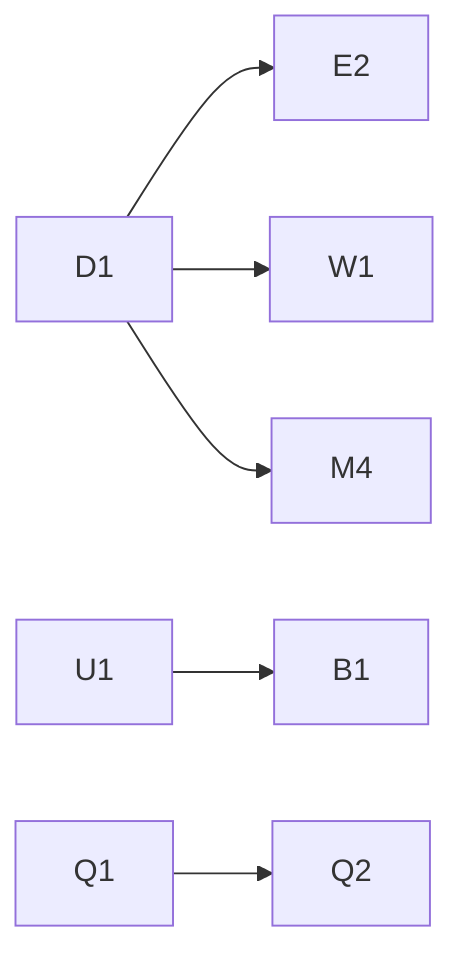

# ロードマップ

> 子セッションはこのファイルを**読むだけ**にする。チェックの更新は、配り役が起動する「ドキュメントのまとめ」の子が行う。
> 項目が尽きたら、配り役が [VISION.md](VISION.md) の「広げていく方向」から次の波を作って、この表に足す（SKILL.md の §11）。

## 今あるもの（v0.1）
- キャラクター作成：職業5・能力値6（振り直し5回＋ボーナス6点・才能限界）・人物設定のおまかせ生成と手直し・目的5
- 場所17（町7・野外6・迷宮4）、船旅、地図、日付と時間帯
- 出来事29、噂14、敵29（ボス6）、アイテム41、トロフィー30
- 戦闘（攻撃・急所・炎・癒し・威圧・賄賂・防御・逃走・道具、仲間の加勢、魔人の絶界）
- 施設（宿屋・酒場・商店・ギルド・教会・訓練場・裏路地・王城）、ギルドの依頼、騎士→領主→国王
- 年表・墓碑・トロフィー（冒険をまたいで残る）
- 自由入力の読み取り（トークンなし）と、任意の「GM に任せる」
- 背景の絵（屋外17種・室内9種・敵の影）
- テスト（データの整合＋150回のランダムプレイ）と CI（`CI result`）

## レーン
同じレーンの中は順番に、別のレーンは同時に進めてよい。**新しい内容は新しいファイルに書き、`src/manifest.json` の該当リストの末尾に追記する**（CLAUDE.md）。

| 記号 | レーン | 書き換えてよいところ |
|---|---|---|
| D | 世界観 | `src/data/world.js`、`docs/lore/` |
| C | キャラクター・コア | `src/data/characters.js`、`src/engine/core.js`、`src/engine/parser.js`、`src/engine/gm.js`、`src/ui/setup.js` |
| I | アイテム | `src/data/items.js`、`src/data/items_*.js` |
| E | 敵 | `src/data/enemies.js`、`src/data/enemies_*.js` |
| W | ワールド | `src/data/locations.js`、`src/data/locations_*.js`、`src/engine/explore.js` の探索・旅・迷宮 |
| F | 施設 | `src/engine/explore.js` の施設・依頼・王城 |
| V | 出来事 | `src/data/events.js`、`src/data/events_*.js` |
| B | 戦闘 | `src/engine/combat.js` |
| T | トロフィー | `src/data/trophies.js` |
| A | 絵 | `src/ui/scene.js` |
| U | 画面 | `src/ui/ui.js`、`src/main.js`、`src/style.css`、`src/index.html` |
| Q | テスト・CI・ツール | `tests/`、`tools/`、`.github/` |

## 項目
波1はすべて同時に始められる。前提のある項目は、前提がマージされてから。

| ID | 中身 | レーン | 前提 | 波 |
|---|---|---|---|---|
| D1 | 世界観の拡充：十三魔人の残り十体の名前・二つ名・性格・居場所の設定を `docs/lore/majin.md` に。三天神と魔王の設定も深める | D | なし | 1 |
| V1 | 町の出来事を15件追加（`events_town2.js`）。残酷さとばかばかしさを両方 | V | なし | 1 |
| V2 | 野外・迷宮の出来事を15件追加（`events_wild2.js`） | V | なし | 1 |
| E1 | 地域ごとの敵を12種追加（`enemies_2.js`）。段1〜5をまんべんなく | E | なし | 1 |
| I1 | アイテム追加：武器・防具・装飾品を15種。装飾品（ring）の枠を core と画面に | I＋C | なし | 1 |
| A1 | 背景の強化：季節（夏の緑・秋の紅葉・冬の雪）と天候（雨・霧）、町ごとの違い | A | なし | 1 |
| U1 | スマホでの遊びやすさ：行動ボタンの並び、記録の見やすさ、ステータスの開閉 | U | なし | 1 |
| Q1 | 釣り合いの測定：職業ごとの平均生存手番・死因・到達地をテストで集計して出力（CI の失敗にはしない） | Q | なし | 1 |
| M1 | 魔法の種類（氷・雷・呪い・加護）と、学院・魔導書で覚える仕組み | B＋C | なし | 1 |
| E2 | 魔人を2体追加し、それぞれ居城の迷宮と、倒せなくても関われる出来事を | E＋W＋V | D1 | 2 |
| W1 | 新しい地域：光天教会の聖都と地下墓地、八雲の離島 | W＋V | D1 | 2 |
| M2 | 仲間の個性：会話の出来事、好感度、裏切り、死別 | C＋V | なし | 2 |
| M3 | 評判：国ごとの評判と悪名。悪行で賞金首になり、衛兵に追われる | C＋V | なし | 2 |
| M4 | 世界の出来事：日数が進むと魔人が町を襲う・国同士の戦争が始まる | W＋V | D1 | 2 |
| B1 | 戦闘の演出：ダメージの揺れ・敵の倒れる演出・ボス戦の前口上 | B＋U | U1 | 2 |
| Q2 | 釣り合いの調整：Q1 の数字を見て、敵の強さ・金の入り方・成長の速さを直す | E＋B | Q1 | 2 |

## 衝突を避けるための約束
- **新しい内容は新しいファイルへ**。既存の `events.js`・`enemies.js`・`items.js`・`locations.js` を複数の子が同時に書き換えない。
- **`src/manifest.json`** は末尾への追記だけ。2本が同時に足したら、後から入るほうが両方残す。
- **`src/engine/core.js`** と **`src/ui/ui.js`** は大きな共有ファイル。C・U 以外のレーンは「関数を1つ足す」程度の追記だけにし、同時に触る子は2本まで。
- **セーブの形（`G.S`）** に項目を足すときは、古いセーブでも動くように既定値を書く。
- **トロフィーのキー・出来事の id・敵の id** は重ならないように、`<レーンの記号><番号>_` を頭に付ける（例：`v1_bridge`）。
- 見た目の大きな作り直しは単独の期間を取る。

## 決定待ちの issue
（配り役が `needs-decision` ラベルで立てたものをここにまとめる）
