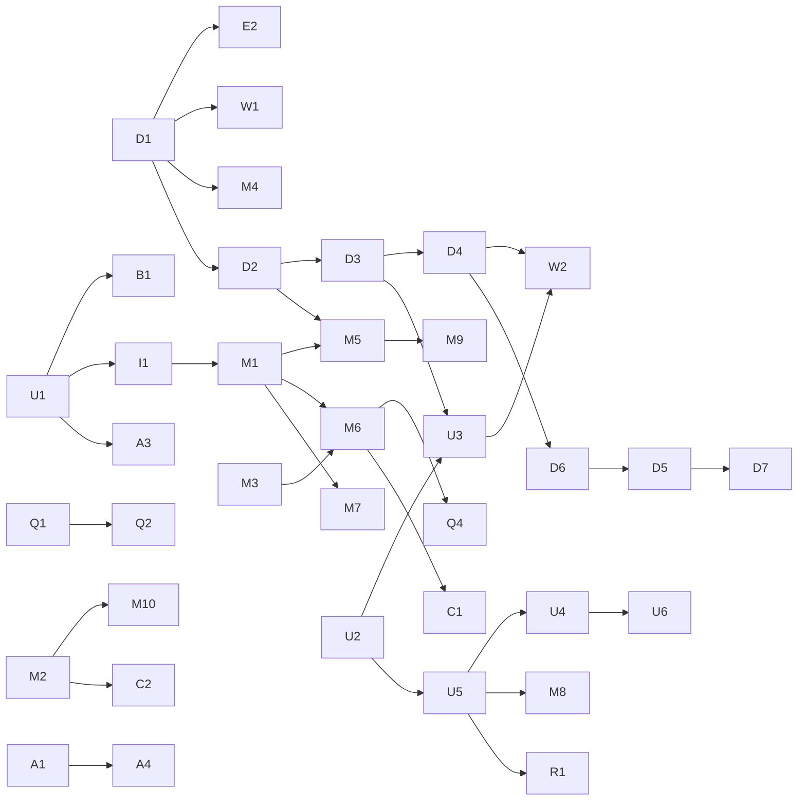

# ロードマップ

> 子セッションはこのファイルを**読むだけ**にする。チェックの更新は、配り役が起動する「ドキュメントのまとめ」の子が行う。
> 項目が尽きたら、配り役が [VISION.md](VISION.md) の「広げていく方向」から次の波を作って、この表に足す（SKILL.md の §11）。
> 最後のまとめ：2026-10-01（main は D7 #128 のマージまで）。数字は各 PR の説明から写したもの。項目表はすべて ✅（VISION の「完成の定義」の根拠は [VISION.md](VISION.md) に）。

## 今あるもの（v0.3）
- 題は付けない（U2 #58 の「Morsveld」は持ち主の決定で取り下げ。タイトル画面は背景の絵とメニューだけ、タブ名は「一人用TRPG」）。舞台の大陸にも名前を付けない（「ヴェルド」も無くした）。出力と保存の鍵は内部の名前のまま `dist/morsveld.html`・`morsveld-*`。古い保存の鍵（`kotodama3-*`）は起動時に移し替える
- キャラクター作成（U5 #72）：タイトル →「はじめる」→ 人物を一画面で選ぶ（名前・性別・年齢・種族 3・生まれ 8・職業 5・目的 5・生い立ち）→ 能力値を**何度でも振り直す**（鍵 3 つ・ボーナス 6 点・才能限界）→ キャラクターシート → 導入（本のページ 3 枚）→ 最初の町
- 場所（W1 #44 の時点で 20。そのあと W2 #86 で町 5・帝国の谷 3、E2 #46 で居城の迷宮）、船旅、地図、日付と時間帯、季節と天候（A1 #67）
- 出来事 67・敵 49・アイテム 56（W1 #44 の時点）。そのあと M1 #59（術 4・魔導書 4・出来事 2）、U3 #77（調べる物と人の出来事 15・噂 6・通行人のひとこと 48 行・用語説明 36 項目）、M3 #54（出来事 `m3_`・賞金稼ぎ）が加わった
- 戦闘（攻撃・急所・炎・癒し・**氷・雷・呪い・加護**・威圧・賄賂・防御・逃走・道具、仲間の加勢、使徒の絶界、狙う敵を選ぶ（U6 #101）、敵の台詞と逃げ方）
- 術の習得（学院・魔導書）と「借り」（`S.magicDebt`）（M1 #59）
- 装飾品の枠 `S.ring`（I1 #33）
- 国ごとの評判と悪名・賞金首・衛兵・罪の匂いと咎追い（M3 #54）
- 判定の振り直し（M7 #82）、正気・獣の病・代償つきの品（M5 #83。獣の病は疫医ベルナだけが持つ病：M9 #111）
- 世界の出来事（使徒の襲来・皇帝の病と代替わり・三国の戦と協定、M4 #85）。滅んだ町は立ち直る
- 仲間の個性・好感度・会話・裏切り・死別（M2 #74）、恋と結婚（M10 #118）、スプレッドシートの人物（C2 #125）
- 人の才（技能ごとの Lv0〜3）と伸びしろ（M8 #110）、種族（人間・エルフ・獣人、R1 #124）
- 終わり方と人生の物語（M6 #91）：死ぬまでが基本、節目で終えられる、その後のダイジェスト。光の壁のあとも旅を続けられる（C1 #114）
- 二振りの剣に代償なし・銃は遺物のレア物（C1 #114）
- 魔王なし・使徒は誰の配下でもない（D6 #116）。国名・町名はスプレッドシートの名、「使徒」「眷属」（D5 #127）。語りはゲームブック風（D7 #128）
- 戦闘の演出（B1 #68）、すべての場面の絵（A4 #95）、目的 5 つの道筋の通し確認（Q4 #100）、筋のよい遊び方のボットと釣り合い（Q2 #97）
- 施設（宿屋・酒場・商店・ギルド・教会・訓練場・裏路地・王城・学院）、ギルドの依頼、騎士→領主→国王
- 年表・墓碑・トロフィー（冒険をまたいで残る）
- 分かったことだけ書き足される用語説明（`S.lore`・`G.P.loreSeen`）と、通行人のひとこと（U3 #77）
- 自由入力の読み取り（トークンなし）と、任意の「GM に任せる」
- 絵（すべて canvas）：背景（屋外・室内・学院、季節・天候・町ごとの違い）、モンスター（部品の組み合わせ・`look`、A2 #31）、人物（18 種・主人公・仲間・出来事の `who`、A3 #36）
- 音（すべて Web Audio でその場で合成）：効果音 30 種・環境音 7 種・音量と消音（S1 #65）。演出と同じ瞬間に鳴る（B1 #68）
- テスト（データの整合＋150 回のランダムプレイ＋`tests/checks/*.mjs` の自動読み込み）、釣り合いの測定（`tests/balance.mjs`、Q1 #19）、CI（`CI result`）
- 世界の設定書 `docs/lore/world.md`（入口・食い違ったらこれが正）と、`life.md`・`igyo.md`・`gods.md`・`majin.md`・`history.md`・`curses.md`・`strata.md`・`reveal.md`・`voice.md`

## レーン
同じレーンの中は順番に、別のレーンは同時に進めてよい。**新しい内容は新しいファイルに書く。`src/data/`・`src/engine/`・`src/ui/` に置けば自動で読まれるので、`src/manifest.json` は編集しない**（Q3 #70。CLAUDE.md）。新しい確認は `tests/checks/<id>.mjs` に置けば自動で読まれる。

| 記号 | レーン | 書き換えてよいところ |
|---|---|---|
| D | 世界観 | `src/data/world.js`、`docs/lore/` |
| C | キャラクター・コア | `src/data/characters.js`、`src/engine/core.js`、`src/engine/parser.js`、`src/engine/gm.js`、`src/ui/setup.js` |
| I | アイテム | `src/data/items.js`、`src/data/items_*.js` |
| E | 敵 | `src/data/enemies.js`、`src/data/enemies_*.js` |
| W | ワールド | `src/data/locations.js`、`src/data/locations_*.js`、`src/engine/explore.js` の探索・旅・迷宮 |
| F | 施設 | `src/engine/explore.js` の施設・依頼・王城（包む形のファイル。例：`academy_m1.js`） |
| V | 出来事 | `src/data/events.js`、`src/data/events_*.js` |
| B | 戦闘 | `src/engine/combat.js` |
| T | トロフィー | `src/data/trophies.js` |
| A | 絵 | `src/ui/scene.js`、`src/ui/art_monsters.js`、`src/ui/art_people.js` |
| S | 音 | `src/ui/sound.js` |
| U | 画面 | `src/ui/ui.js`、`src/ui/setup.js`、`src/main.js`、`src/style.css`、`src/index.html` |
| Q | テスト・CI・ツール | `tests/`、`tools/`、`.github/` |

## 項目
波1はすべて同時に始められる。前提のある項目は、前提がマージされてから。「追加」は波1・波2のあとに配り役が足した項目。

| 状態 | ID | 中身 | レーン | 前提 | 波 | issue / PR |
|---|---|---|---|---|---|---|
| ✅ | D1 | 世界観の拡充：十三魔人の残り十体・三天神・魔王（`docs/lore/majin.md`・`gods.md`） | D | なし | 1 | #2 / #21 |
| ✅ | V1 | 町の出来事を15件＋続き1件・噂8（`events_town2.js`） | V | なし | 1 | #3 / #29 |
| ✅ | V2 | 野外・迷宮の出来事を15件追加（`events_wild2.js`） | V | なし | 1 | #4 / #34 |
| ✅ | E1 | 地域ごとの敵を12種（段1〜5）と、台詞と逃げ方（`foe_quirks.js`） | E | なし | 1 | #5 / #27 |
| ✅ | I1 | 武器・防具・装飾品を15種、装飾品の枠 | I＋C | U1 | 1 | #6 / #33 |
| ✅ | A1 | 背景に季節・天候・町ごとの違い、学院の室内（`weather.js`） | A | なし | 1 | #7 / #67 |
| ✅ | U1 | スマホでの遊びやすさ（行動ボタン2列・記録の枠・ステータスのシート） | U | なし | 1 | #8 / #23 |
| ✅ | Q1 | 釣り合いの測定（`tests/balance.mjs`。CI の失敗にはしない） | Q | なし | 1 | #9 / #19 |
| ✅ | M1 | 氷・雷・呪い・加護の術と、学院・魔導書で覚える仕組み | B＋C | I1 | 1 | #10 / #59 |
| ✅ | E2 | 魔人を2体（暴食のゴルモア・腐爛のモルドゥ）、居城の迷宮と関われる出来事 | E＋W＋V | D1 | 2 | #11 / #46 |
| ✅ | W1 | 聖都サンクタと地下墓地、八雲の離島・朧島 | W＋V | D1 | 2 | #12 / #44 |
| ✅ | M2 | 仲間の個性（性格・好感度・会話・裏切り・死別） | C＋V | なし | 2 | #13 / #74 |
| ✅ | M3 | 国ごとの評判と悪名、賞金首と衛兵、罪の匂いと咎追い | C＋V | なし | 2 | #14 / #54 |
| ✅ | M4 | 世界の出来事（魔人・異形の襲来、皇帝の病と代替わり、三国の戦と協定） | W＋V | D1 | 2 | #15 / #85 |
| ✅ | B1 | 戦闘の演出（ダメージの揺れ・倒れる演出・ボスの前口上） | B＋U | U1 | 2 | #16 / #68 |
| ✅ | Q2 | 釣り合いの調整：Q1 の数字を見て、敵の強さ・金の入り方・成長の速さを直す | E＋B | Q1 | 2 | #17 / #97 |
| ✅ | A2 | モンスターの絵（部品の組み合わせ・`look`） | A | なし | 追加 | #24 / #31 |
| ✅ | A3 | 人物の絵（主人公・仲間・出来事の `who`） | A＋U | U1 | 追加 | #25 / #36 |
| ✅ | D2 | 世界観の深掘り（失われた王国・代償の力・正気・獣憑き・明けずの町） | D | D1 | 追加 | #37 / #41 |
| ✅ | D3 | 持ち主の世界観メモから（異形・格・刻印の環・失われた技術）と、明かす段階 | D | D2 | 追加 | #47 / #52 |
| ✅ | D4 | スプレッドシートを土台に世界の設定書を作り直す（`world.md`・`life.md`・`igyo.md`） | D | D3 | 追加 | #75 / #79 |
| ✅ | U2 | タイトルを「Morsveld」に（のちに持ち主の決定で題も大陸の名「ヴェルド」も無くした。内部の名前は morsveld のまま） | U＋Q | なし | 追加 | #42 / #58 |
| ✅ | Q3 | `manifest.json` を触らずに新しいファイルを足せるように（`tools/files.mjs`・`tests/checks/`） | Q | なし | 追加 | #69 / #70 |
| ✅ | S1 | 効果音と環境音（Web Audio。音声ファイルなし） | S | なし | 追加 | #60 / #65 |
| ✅ | U3 | 語りの手引き（`voice.md`）、分かったことだけ書き足す用語説明・通行人・調べる物 | U＋V＋C | D3・U2 | 追加 | #48 / #77 |
| ✅ | U5 | キャラクター作成の作り直し（タイトル→人物→振り直し→シート→導入） | U＋C | U2 | 追加 | #63 / #72 |
| ✅ | M5 | 代償つきの力と正気（呪われた武器・狂気・獣の病） | C＋B＋V | D2・M1 | 追加 | #38 / #83 |
| ✅ | M6 | 物語の終わり方と人生の物語（死ぬまでが基本／節目で終えられる／ダイジェスト） | C＋V＋U | M1・M3 | 追加 | #55 / #91 |
| ✅ | M7 | 冒険中の判定の振り直し（貴重な回数・旅で増える） | C＋U＋V | M1 | 追加 | #62 / #82 |
| ✅ | U4 | 画面の分かりやすさの見直し（通しで遊んで不親切な所を洗い出して直す） | U | U2・U5 | 追加 | #61 / #89 |
| ✅ | W2 | 場所・王城・町を世界の設定書に合わせ、まだ無い町を足す | W＋F | D4・U3 | 追加 | #80 / #86 |
| ✅ | A4 | 絵がすべての場面で出るか洗い出し、足りない絵を足す | A | A1・A3 | 追加 | #93 / #95 |
| ✅ | Q4 | 目的 5 つの道筋を通しで確かめ、詰まる所を直す | Q＋W＋V | M6 | 追加 | #92 / #100 |
| ✅ | U6 | 分かりやすさの残り（戦闘の狙い・書き足しの重複・旅立ちの遅れ・鍵のラベル・スマホの「行動へ」） | U | U4 | 追加 | #88 / #101 |
| ✅ | M8 | 人の才（技能ごとの才 Lv0〜3）と伸びしろ | C＋U | U5 | 追加 | #102 / #110 |
| ✅ | M9 | 獣の病を疫医ベルナだけが持つ病に | C＋E＋V | M5 | 追加 | #103 / #111 |
| ✅ | M10 | 仲間との恋と結婚 | C＋V＋U | M2 | 追加 | #107 / #118 |
| ✅ | C1 | 持ち主の決定（剣の代償なし・銃は遺物のレア物・光の壁のあとも旅を続けられる） | C＋B＋V | M6 | 追加 | #104 / #114 |
| ✅ | D6 | 魔王と神々（魔王は昔いて死んでいる・神々はもういない・使徒は誰の配下でもない） | D | D4 | 追加 | #106 / #116 |
| ✅ | R1 | 種族（人間・エルフ・獣人）を作成で選び、暮らしに反映 | C＋U＋D | U5 | 追加 | #120 / #124 |
| ✅ | C2 | スプレッドシートの「キャラメモ」の人物を仲間・名のある人物に | C＋V＋A | M2 | 追加 | #119 / #125 |
| ✅ | D5 | 国名・町名をスプレッドシートに、魔人・異形を「使徒」、旧「使徒」を「眷属」に | D＋全レーン | D6 | 追加 | #105 / #127 |
| ✅ | D7 | 語りをゲームブック風に寄せる | D＋U | D5 | 追加 | #121 / #128 |

✅ マージ済み　🔄 PR が開いている　⬜ まだ PR が無い

## 結果（マージした PR の説明から）
- **Q1 #19**（今の main の前の測り方、職業ごとに 400 回・種 0）：平均手番 魔法使い 57・傭兵 77・破戒神官 91・盗賊 100・侍 113。死亡率 98〜100%、ボス撃破 0（ランダムな遊び方は宿で休まないため。#18）。
- **E1 #27**：新しい敵 12 種が 150 回で 385 体出た。平均手番は少し延びた（侍 113 → 121 など）。
- **I1 #33**：I1 の 15 種のうち 12 種がランダムプレイで手に入った。釣り合いは揺れの範囲。
- **M1 #59**：魔法使いの平均手番 58 → 62。遊ぶうちに覚えた術：加護 11・氷 5・雷 5・呪い 1。
- **W1 #44**：到達率 聖都 14〜66%・地下墓地 6〜27%・朧島 0〜10%。地下墓地で死んだ数はロゥムに次ぐ 2 位（#43）。
- **S1 #65**：効果音・環境音 37 件の波形を測り、すべて基準内（クリップ 0）。耳では未確認（#64）。
- **A1 #67**：全場面×季節×天候×時間帯の 768 枚を例外なく描ける。
- **M3 #54**（職業ごとに 400 回・種 0）：平均手番 魔法使い 55・破戒神官 90・傭兵 88・盗賊 113・侍 126。150 回のうち賞金首になった回 11。
- **Q3 #70**：ビルドの出力が前とバイト単位で同じことを確かめた。
- **Q2 #97**：筋のよい遊び方のボット（`tests/bot.mjs`）を足し、職業の釣り合いを直した。ランダムでも筋のよい遊び方でも、平均生存手番の差は 1.5 倍以内。筋のよい遊び方ならボスを倒す回がある（`tests/checks/q2_balance.mjs` が毎回確かめる。C2 #125 で筋のよい遊び方を 30 回に）。今の main（D7 #128）で測ると、ランダム 1.43 倍（傭兵 80・侍 115）、筋のよい遊び方 1.20 倍（魔法使い 1097・破戒神官 1318）。
- **Q4 #100**：目的 5 つそれぞれ、行動の一覧から選ぶだけで節目まで届き、節目の前後で保存と読み込みをしても続けられる（`tests/checks/q4_goals.mjs`）。
- **A4 #95**：すべての場所・施設・敵・出来事の人物に絵がある（`tests/checks/a4_art.mjs`）。
- **D5 #127**：場所・敵・アイテムの id は変えず、古いセーブの国名は読み込むときに移す（`tests/checks/d5_names.mjs`）。

## 衝突を避けるための約束
- **新しい内容は新しいファイルへ**。既存の `events.js`・`enemies.js`・`items.js`・`locations.js` を複数の子が同時に書き換えない。
- **`src/manifest.json` は編集しない**（Q3 #70 から自動で読まれる）。どうしても順番が効くときだけ書く。書いても二重には読まない。
- **`explore.js`・`combat.js` は包む形で**（`academy_m1.js`・`foe_quirks.js`・`m3_repute.js` のように、関数を包む新しいファイル）。
- **`src/engine/core.js`** と **`src/ui/ui.js`** は大きな共有ファイル。C・U 以外のレーンは「関数を1つ足す」程度の追記だけにし、同時に触る子は2本まで。
- **セーブの形（`G.S`）** に項目を足すときは、古いセーブでも動くように既定値を書く。
- **トロフィーのキー・出来事の id・敵の id** は重ならないように、`<レーンの記号><番号>_` を頭に付ける（例：`v1_bridge`）。
- **プレイヤーに見える文**は `docs/lore/voice.md` と `docs/lore/world.md` の段階の印（〔知〕〔噂〕〔進〕〔秘〕）に従う。〔秘〕は書かない。`tests/checks/u3_voice.mjs` が禁じた言葉を確かめる。
- 見た目の大きな作り直しは単独の期間を取る。

## 決定待ちの issue（2026-10-01 の時点で開いているもの）
推しの案で進めてある。持ち主が決めるまで、その案のままでよい（止めているものは無い）。決まったものは閉じてある（#20・#39・#40・#50・#51・#56・#76・#90・#96・#99・#126 など）。

| issue | 題 |
|---|---|
| #18 | 釣り合いの測定の遊び方：ランダムのままか、筋のよい遊び方の bot を足すか |
| #22 | U1: スマホ画面の並びと大きさ（推しの案で実装済み） |
| #26 | 敵の台詞と逃げ方の仕組みを combat.js に取り込むか（E1） |
| #28 | 出来事の結果で能力値を下げられるようにするか（ザルヴェの担保） |
| #30 | A2: モンスターの絵柄（輪郭つきの色塗り）と色づかい |
| #32 | 装飾品（I1）：呪いの外し方・枠の数・効き目の種類 |
| #35 | 墓碑（過去の冒険者）に人物の絵を出すか |
| #43 | W1：聖都の名前と、地下墓地の危険度（名は D5 で「聖都エルヴィナ」に） |
| #45 | E2: 腐れ庭園を毒沼の湿地の隣（1日）に置くか、もっと奥にするか |
| #49 | メモの「使徒」を「異形」と呼び、格を「天災・国難・討伐」にするか（呼び名は D5 で「使徒」に戻った。格は残る） |
| #53 | M3: 名声と悪名の関係・力ずくの王位・鈴の執行人の扱い |
| #57 | M1: はじめから覚えている術と、呪いを学院で教えないこと |
| #64 | 音：音色の好みと、BGM を入れるか |
| #66 | A1: 町ごとの気候の決め方（聖都に雨が降らない・朧島の季節が止まっている など） |
| #71 | U5 キャラクター作成：鍵の数・年齢と生まれの効果・出発地の決め方 |
| #73 | 仲間の好感度を数で見せるか、言葉だけにするか（M2） |
| #78 | 用語説明（手引きの世界観の項目）を冒険をまたいで残すか |
| #81 | M7 振り直しの数字（持ち始め・上限・増え方） |
| #84 | M4：滅んだ町は、いつか人が戻るか（戻らないままにするか） |
| #94 | A4 の絵で推しの案で進めたこと（闘技場の観覧席・疫医の顔・出来事の who の決まり） |
| #98 | 「大富豪になる」の道筋を交易にしてよいか（ザルヴェ金融商会の投資も足すか） |
| #108 | 獣の病（ベルナの病）が 3 段を越えたら助かる道を残すか |
| #109 | M8: 才なし（Lv0）に成功率の罰を付けるか |
| #112 | 遺物の銃（雷筒・光筒）の強さ・入手先・弾の量 |
| #113 | 光の壁に触れて「旅を続ける」を選んだあとに残るもの |
| #115 | D6 の細部：魔王の死の扱い・内側の十三・眷属・神々がいなくなった時期・正体の分からない旅人 |
| #117 | M10 恋と結婚の細かい決まり（相手・人数・子ども・家の値段） |
| #122 | R1 種族：盟主の扱い・獣の種類・数値・割合 |
| #123 | C2：王国の玉座・帝国の皇帝の病・ノラの元の獣（キャラメモの人物とゲームの食い違い） |
