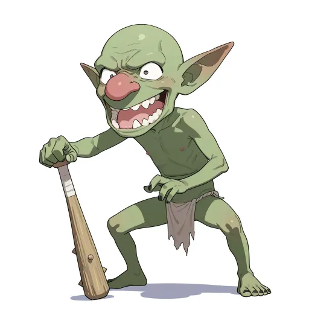
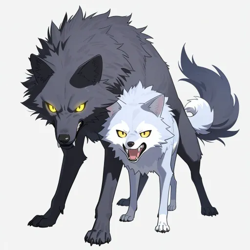
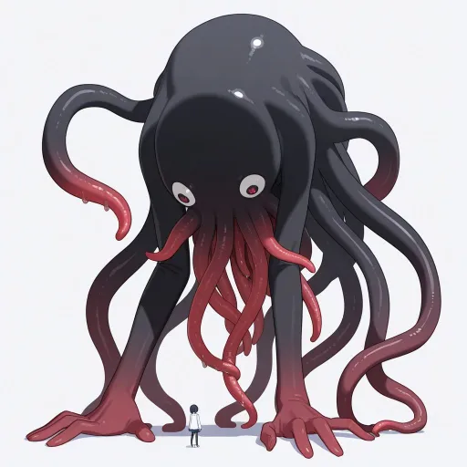

# 試し：2モデル × 2プロンプトの比較（ノラ・シェイラ）

seed は固定（nora 1001・sheila 1002。4通りとも同じ）。ほかの設定は `docs/art/style.json`（#148 の立ち絵向けタグ）のまま。切り替えは `docs/art/style.local.json` の上書きで行い、style.json は変えていない。

| 組 | モデル | prefix に足したタグ | ノラ | シェイラ |
|---|---|---|---|---|
| A | `waiIllustriousSDXL_v160.safetensors [a5f58eb1c3]` | なし | （不適切な出力のため削除） |  |
| B | `waiIllustriousSDXL_v160.safetensors [a5f58eb1c3]` | `(detailed face:1.4), sharp focus, (artbook style:1.2), illustrative, intricate details, pop art` |  |  |
| C | `waiIllustriousSDXL_v140.safetensors [bdb59bac77]` | なし | （不適切な出力のため削除） |  |
| D | `waiIllustriousSDXL_v140.safetensors [bdb59bac77]` | B と同じ |  |  |

- 生成：`node tools/gen_portraits.mjs --only <id> --force --new-seed`（一覧の seed を使わず、style.local.json の seed を使う）。512×640 に cwebp で縮めた。
- B・D の追加タグから `textured background` を外して作り直した（持ち主の依頼）。

## 魔物の手早い試し（monsters/）

`/sdapi/v1/txt2img` を直接呼んだ（`tools/gen_portraits.mjs` はまだ魔物に対応していない）。モデル `waiIllustriousSDXL_v160.safetensors [a5f58eb1c3]`、Euler a・Automatic・20 steps・cfg 5.5（style.json と同じ）、1024×1024 で作り、cwebp で 512×512 に縮めた。

- プロンプト ＝ style.json の prefix ＋ 魔物の特徴 ＋ `no humans, monster, creature, solo, full body, simple background, white background`
- ネガティブ ＝ style.json の negative ＋ `1girl, 1boy, human, humanoid face, multiple monsters, group, cropped, out of frame`

| 魔物 | seed | 特徴のタグ | 絵 |
|---|---|---|---|
| goblin | 2001 | `goblin, green skin, pointy ears, big nose, crooked teeth, holding wooden club, ragged loincloth, hunched, silly expression` |  |
| slime | 2002 | `slime, blue translucent body, gelatinous, round, single eye, cute, bubbles inside` |  |
| wolf | 2003 | `wolf, grey fur, snarling, fangs, glowing yellow eyes, feral, gaunt` |  |
| eldritch（不気味な使徒の試し） | 2004 | `eldritch abomination, many eyes, tentacles, black ichor, writhing flesh, faceless, giant, ominous` |  |

- 気づいた点：eldritch は `giant` のせいか、足元に大きさを示す小さな人が描かれた。目も2つだけで many eyes が効いていない。
