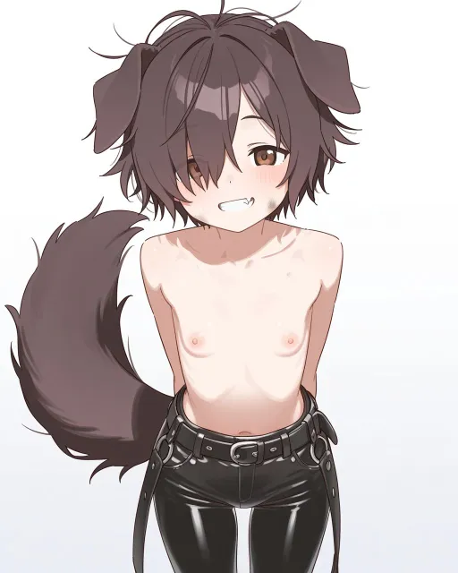
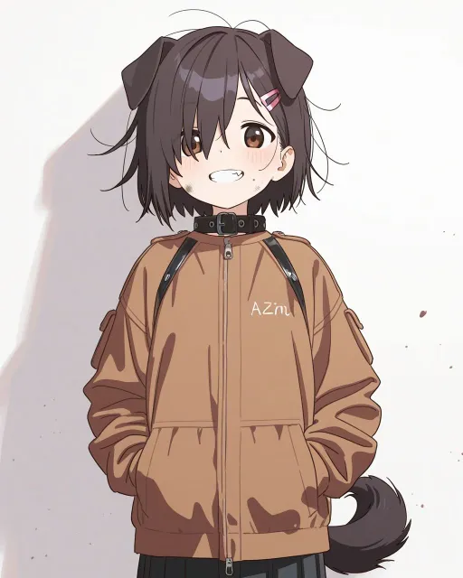
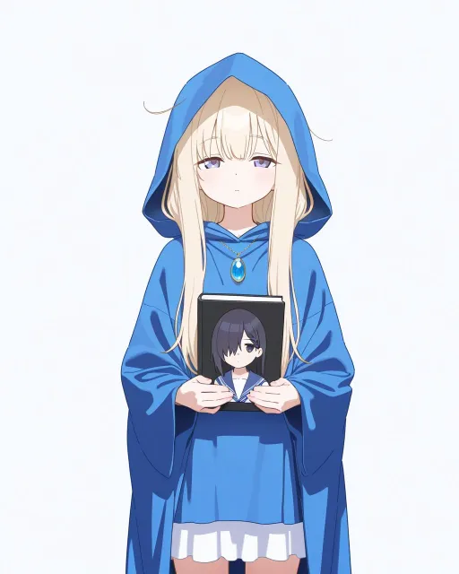
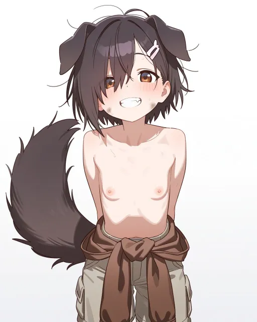
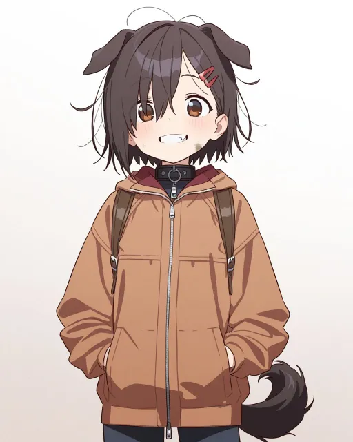

# 試し：2モデル × 2プロンプトの比較（ノラ・シェイラ）

seed は固定（nora 1001・sheila 1002。4通りとも同じ）。ほかの設定は `docs/art/style.json`（#148 の立ち絵向けタグ）のまま。切り替えは `docs/art/style.local.json` の上書きで行い、style.json は変えていない。

| 組 | モデル | prefix に足したタグ | ノラ | シェイラ |
|---|---|---|---|---|
| A | `waiIllustriousSDXL_v160.safetensors [a5f58eb1c3]` | なし |  |  |
| B | `waiIllustriousSDXL_v160.safetensors [a5f58eb1c3]` | `(detailed face:1.4), sharp focus, (artbook style:1.2), illustrative, intricate details, textured background, pop art` |  |  |
| C | `waiIllustriousSDXL_v140.safetensors [bdb59bac77]` | なし |  |  |
| D | `waiIllustriousSDXL_v140.safetensors [bdb59bac77]` | B と同じ |  |  |

- 生成：`node tools/gen_portraits.mjs --only <id> --force --new-seed`（一覧の seed を使わず、style.local.json の seed を使う）。512×640 に cwebp で縮めた。
- 気づいた点：B のノラは上着に意味のない文字（「AZnu」のような字）が出た。
