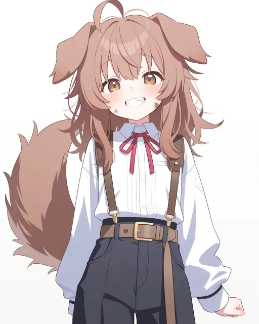
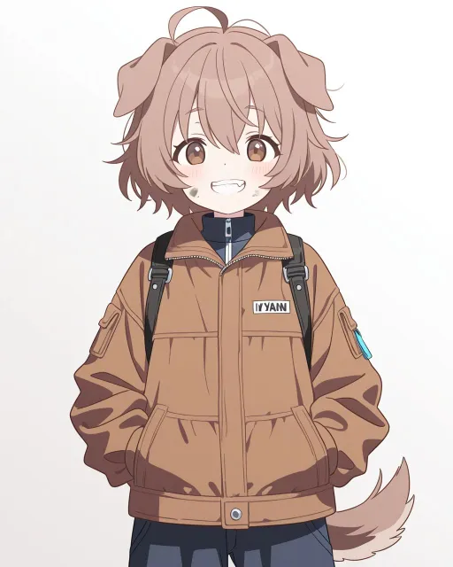
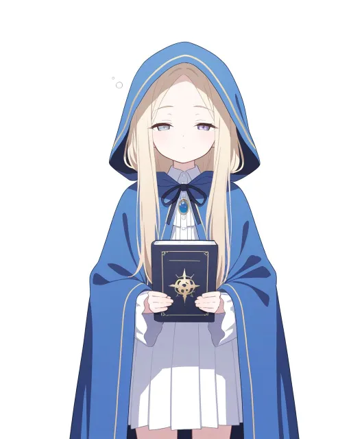
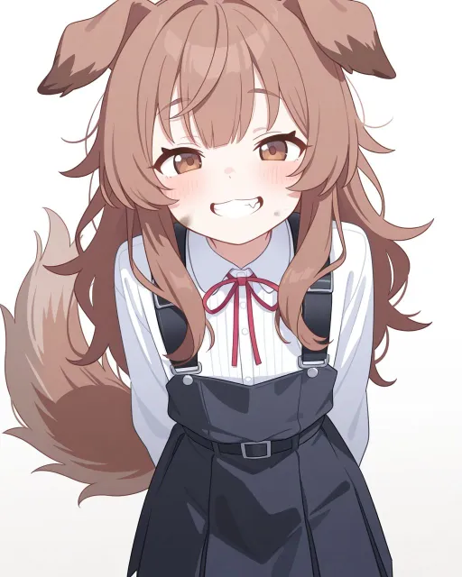
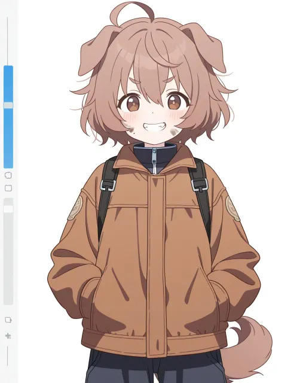
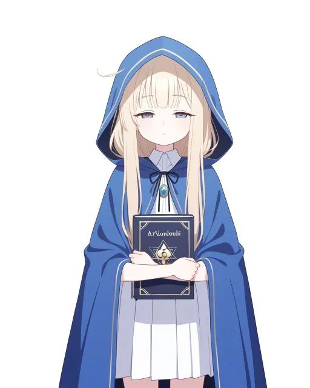
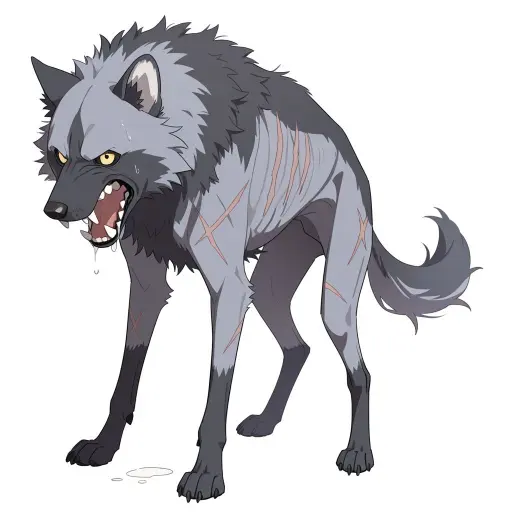
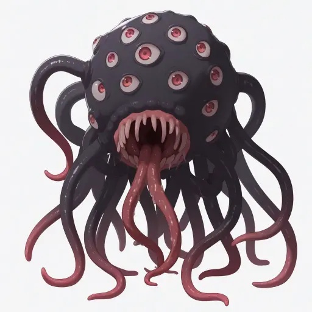

# 比較 2 回目：2モデル × 2プロンプト（ノラ・シェイラ）

main の style.json（#155：prefix から `ikezawa shin` を外し、suffix に `fully clothed`、negative に露出を抑えるタグ）で作り直した。seed は前回と同じ（nora 1001・sheila 1002。4通りとも同じ）。切り替えは `docs/art/style.local.json` の上書きで行い、終わったら消した。

| 組 | モデル | prefix に足したタグ | ノラ | シェイラ |
|---|---|---|---|---|
| A | `waiIllustriousSDXL_v160.safetensors [a5f58eb1c3]` | なし |  |  |
| B | `waiIllustriousSDXL_v160.safetensors [a5f58eb1c3]` | `(detailed face:1.4), sharp focus, (artbook style:1.2), illustrative, intricate details, pop art` |  |  |
| C | `waiIllustriousSDXL_v140.safetensors [bdb59bac77]` | なし |  |  |
| D | `waiIllustriousSDXL_v140.safetensors [bdb59bac77]` | B と同じ |  |  |

- 生成：`node tools/gen_portraits.mjs --only <id> --force --new-seed`。512×640 に cwebp で縮めた。
- 露出のため除外した絵：なし（8枚とも服を着ている）。
- 気づいた点：B のノラは胸の名札に「YAAN」のような文字、D のノラは左端に画面の部品（スクロールバーのような物）、D のシェイラは本の表紙に文字が出た。

## 魔物（monsters/）

モデル v160、style_monsters.json（Euler a・Automatic・20 steps・cfg 5.5・1024×1024、webp 品質 75）、512×512 に cwebp で縮めた。

| 魔物 | seed | 作り方 | 特徴のタグ | 絵 |
|---|---|---|---|---|
| wolf（飢えた野犬） | 2003 | `--monsters --only wolf --force --new-seed`（seed は style_monsters.local.json） | monsters.json の `feral dog, wild dog, skinny, visible ribs, matted grey fur, bared teeth, growling, drooling, four legs, scars`（`solo` は style_monsters.json の suffix に入っている） |  |
| eldritch | 2004 | monsters.json に無いので `/sdapi/v1/txt2img` を直接（prefix・suffix・negative は style_monsters.json） | `eldritch abomination, (many eyes:1.3), tentacles, black ichor, writhing flesh, faceless, ominous`（`giant` を外した） |  |

- wolf は1匹だけ、eldritch は目が多く、小さな人は出なかった。
- wolf のタグは前回（`wolf, grey fur, snarling, …`）ではなく、一覧（monsters.json）の今のタグ。
